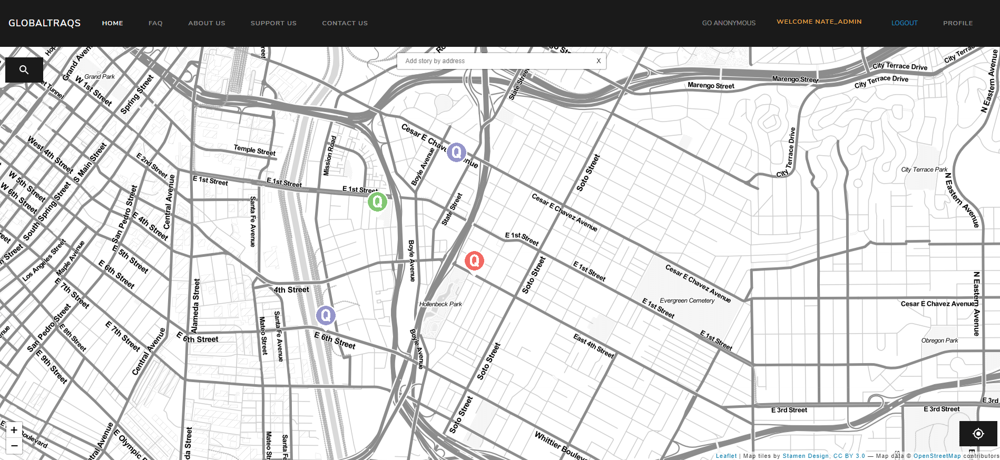
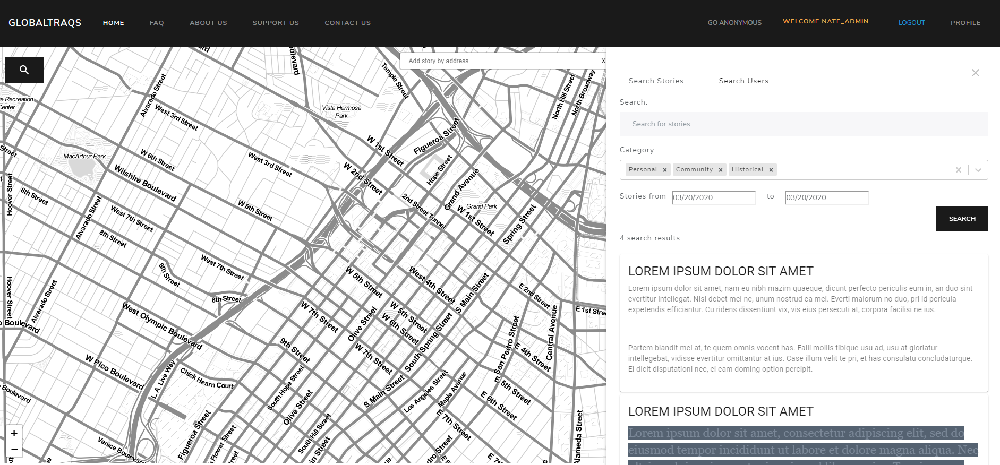
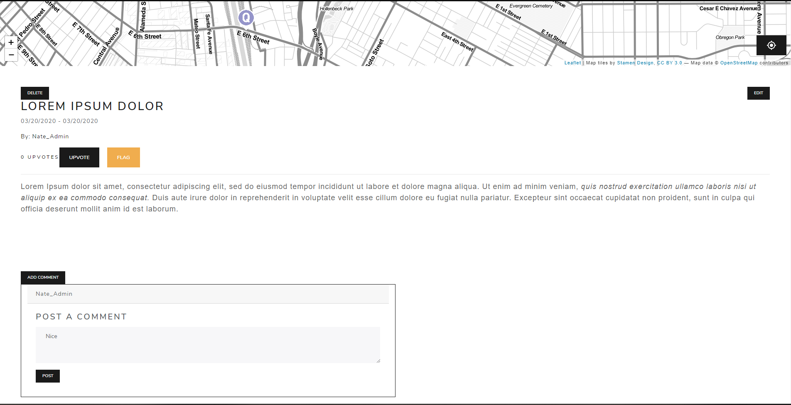
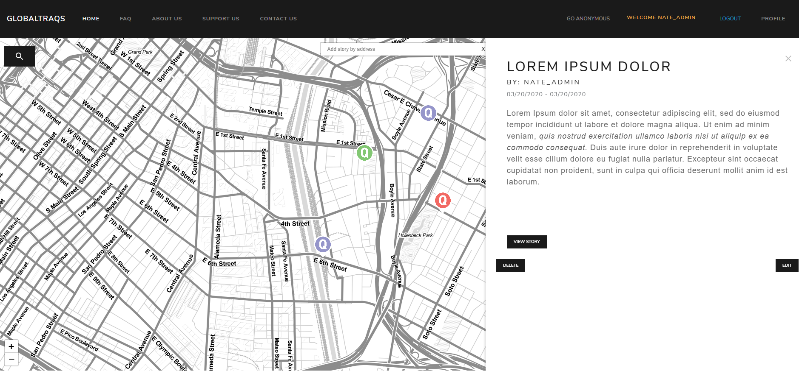

1. [About](https://github.com/jwest115/GlobaltraQs/blob/master/README.md#about)
1. [Instructions](https://github.com/jwest115/GlobaltraQs/blob/master/README.md#globaltraqs) 
1. [Running](https://github.com/jwest115/GlobaltraQs/blob/master/README.md#running)
1. [Screenshots](https://github.com/jwest115/GlobaltraQs/blob/master/README.md#screenshots)

# What is thearQive 

The ArQive, formerly known as GlobaltraQs, is an LGBTQ+ web application that allows anyone to post fun and interesting stories, events, and other information that they find meaningful. Founded in 2014 by Dr. Cynthia Wang and Zachary Vernon, The ArQive gives users a safe platform where they can share personal, historical, and/or community stories, as well as have access to information about safe spaces, which all serve as valuable resources to members of the LGBTQ+ community. By providing users with the ability to place pins on the map indicating where they have been and the experiences they have lived, The ArQive gives people the ability to mark their place in the world and in history.

Originally built in PHP, the previous website required updating and improved features. We decided to use Django and React to make a more dynamic website. We used Django Rest to handle requests faster while using BootStrap to make the website more visually appealing for the user. We are changing the previous website by making the new one more scalable, responsive, and secure. By giving a select group of students the ability to stress test our new website, we can fine tune our website’s user learnability by receiving feedback from regular users. While there are many features pending completion, there will be more improvements coming to the website in the near future.

# Starting Off

We were excited to be using React And Django together. Since it was our first time using these technologies, mistakes and bugs were bound to happen especially following old Youtube Tutorials. Our App initaitally had Django Rest just using the build files of React but found out, performance  was a main concern and had to separate it into different applications. Django Rest was easy to pick up and we were able to develop the  backend much fasater and focus more on the frontend portion.

# Learning

Django Rest was an interesting technology since it uses Python for development. It was a great tech to learn especially as a beginner but performance might be a main concern in the long run. I recommend learning Django for beginners as a stepping stone to learn other technologies.

# Status 

Senior Project is being continued for the Seniors 2021 where they are developing a mobile app and fixing many issues in our project.

# settings.ini

1. open up settings.ini

1. Development Set Debug = True; Production = False

1. Input DB info * could use local postgres or sqlite. Ask for Online DB

1. Input Email Info *dont use your personal email. Ask for Email prod

# first terminal

1. install Python 3.7, pip 

1. pip install pipenv

1. pipenv install

1. pipenv shell

1. cd GlobalTraqs

1. python manage.py makemigrations

1. python manage.py migrate

1. python manage.py runserver

# second terminal

1. install latest version of node

1. npm install

1. npm run dev

clear cache in browser

# Running

1. Go to http://127.0.0.1:8000/admin/ and log into superuser account
1. Click Groups
1. Create groups (Administrators, Moderators, and Anonymous)
1. Assign appropriate permissions (will add more permissions later)
1. http://127.0.0.1:8000/api/category 
    1. add Personal, Historical, Community 
    1. Adds the categories

# ScreenShots of 2019 Development

